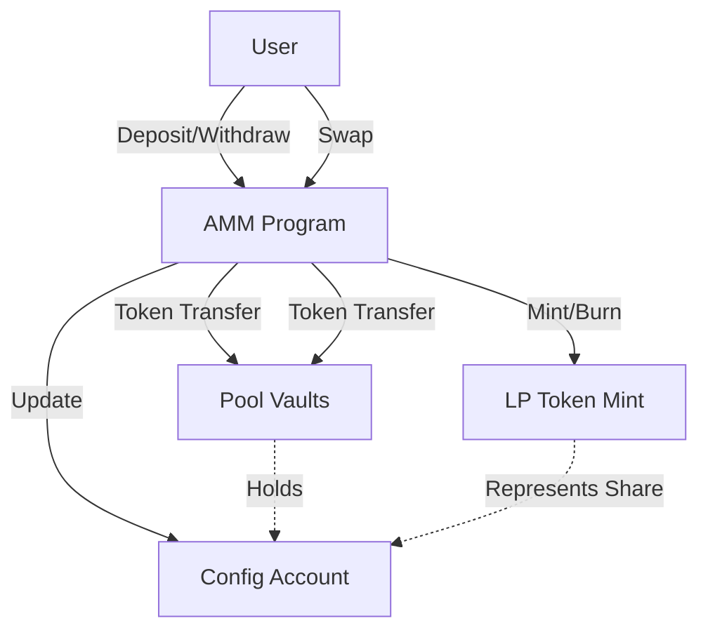
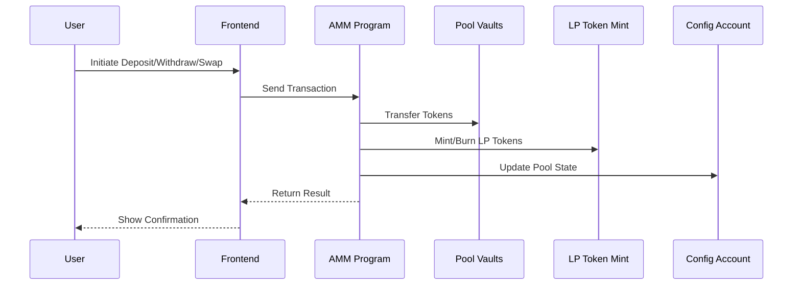

# AMM (Automated Market Maker)

## Overview
This project implements a simple Automated Market Maker (AMM) on Solana using Anchor. It allows users to:
- Deposit tokens into a liquidity pool
- Withdraw tokens and burn LP tokens
- Swap between two tokens using a constant product formula
- Earn trading fees as liquidity providers

## Features
- Constant product curve (Uniswap-style)
- LP token minting and burning
- Slippage protection
- Pool locking/unlocking by admin
- Fully on-chain logic

## Directory Structure
- `programs/amm/` - Solana program (smart contract)
- `tests/` - Integration tests
- `migrations/` - Deployment scripts
- `app/` - (Optional) Frontend or client code

## Setup
1. **Install dependencies:**
   ```sh
   yarn install
   # or
   npm install
   ```
2. **Build the program:**
   ```sh
   anchor build
   ```
3. **Run tests:**
   ```sh
   anchor test
   ```

## Usage
- **Deposit:** Add liquidity to the pool and receive LP tokens.
- **Withdraw:** Burn LP tokens to withdraw your share of the pool.
- **Swap:** Trade between the two pool tokens at the current price.

## Workflow Diagrams

### 1. High-Level Flow

**Explanation:**
- Users interact with the AMM program to deposit, withdraw, or swap tokens.
- The program manages token transfers, LP token minting/burning, and updates the pool configuration.

### 2. Sequence Diagram

**Explanation:**
- The user initiates an action via the frontend.
- The frontend sends a transaction to the AMM program.
- The program processes the request, updates vaults, mints/burns LP tokens, and updates the config.
- Results are returned to the frontend and shown to the user.

## Contributing
Pull requests and issues are welcome!

## License
MIT 