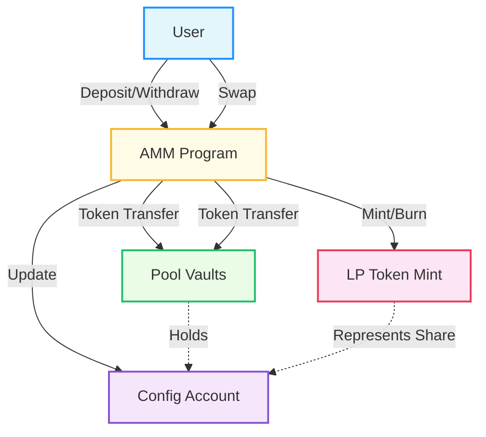
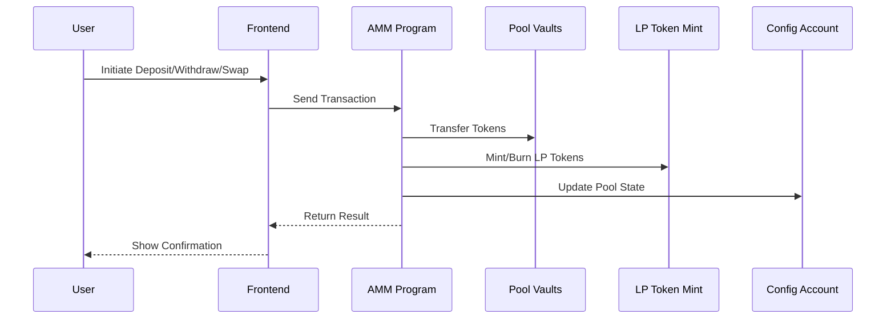

<!-- PROJECT BANNER -->
<p align="center">
  
</p>

<h1 align="center">AMM (Automated Market Maker) ⚡️</h1>

<p align="center">
  <b>Solana-based AMM built with Anchor • Swap tokens • Provide liquidity • Earn fees</b>
</p>

<p align="center">
  <a href="https://solana.com/" target="_blank"></a>
  <a href="https://project-serum.github.io/anchor/" target="_blank"></a>
  
</p>

---

## 🚀 Overview
This project implements a simple Automated Market Maker (AMM) on <b>Solana</b> using <b>Anchor</b>. It allows users to:

- 💧 <b>Deposit</b> tokens into a liquidity pool
- 🔥 <b>Withdraw</b> tokens and burn LP tokens
- 🔄 <b>Swap</b> between two tokens using a constant product formula
- 💸 <b>Earn</b> trading fees as liquidity providers

---

## ✨ Features

> - ⚖️ Constant product curve (Uniswap-style)
> - 🪙 LP token minting and burning
> - 🛡️ Slippage protection
> - 🔒 Pool locking/unlocking by admin
> - ⛓️ Fully on-chain logic

---

## 📁 Directory Structure
- `programs/amm/` — Solana program (smart contract)
- `tests/` — Integration tests
- `migrations/` — Deployment scripts
- `app/` — (Optional) Frontend or client code

---

## ⚡️ Quick Start

1. **Install dependencies:**
   ```sh
   yarn install
   # or
   npm install
   ```
2. **Build the program:**
   ```sh
   anchor build
   ```
3. **Run tests:**
   ```sh
   anchor test
   ```

---

## 🛠 Usage

> - <b>Deposit:</b> Add liquidity to the pool and receive LP tokens.
> - <b>Withdraw:</b> Burn LP tokens to withdraw your share of the pool.
> - <b>Swap:</b> Trade between the two pool tokens at the current price.

---

## 🤔 What is an AMM?

An **Automated Market Maker (AMM)** is a smart contract that enables users to trade tokens and provide liquidity without relying on a traditional order book. Instead, it uses a mathematical formula (like the constant product formula: `x * y = k`) to determine prices and facilitate swaps. Liquidity providers deposit pairs of tokens into the pool and receive LP tokens representing their share. Traders can swap tokens instantly, and liquidity providers earn a portion of the trading fees.

This AMM is inspired by Uniswap and built for the Solana blockchain using the Anchor framework. It supports:
- Depositing tokens to earn fees
- Withdrawing tokens by burning LP tokens
- Swapping between two tokens
- Slippage protection and admin controls

---

## 🧩 Workflow Diagrams

### 1. High-Level Flow



> **How to read this:**
> - The user interacts with the AMM program to deposit, withdraw, or swap tokens.
> - The AMM program manages token transfers, LP token minting/burning, and updates the pool configuration.
> - Colorful boxes represent different on-chain accounts and their roles.

### 2. Sequence Diagram



> **How to read this:**
> - The user starts an action in the frontend, which sends a transaction to the AMM program.
> - The program processes the request, updates vaults, mints/burns LP tokens, and updates the config.
> - Results are returned to the frontend and shown to the user.

---

## 🤝 Contributing
Pull requests and issues are welcome!

---

## 📄 License
MIT

---

<p align="center">
  <sub>Powered by <a href="https://solana.com/">Solana</a> & <a href="https://project-serum.github.io/anchor/">Anchor</a></sub>
</p> 
